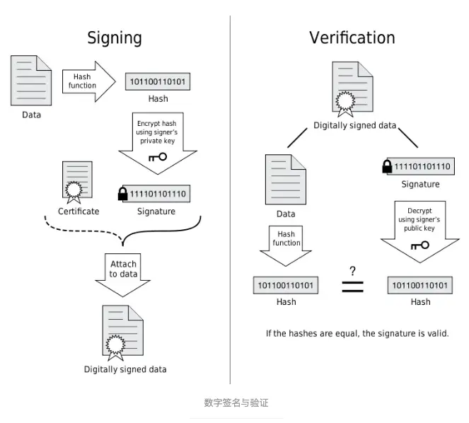
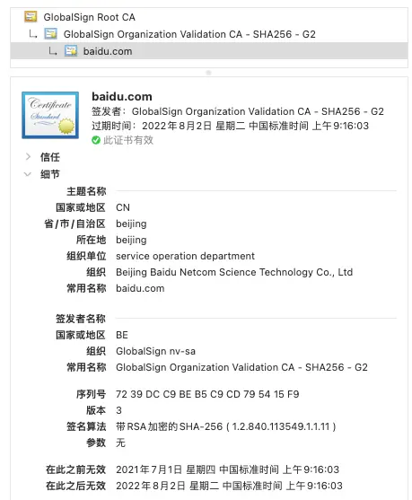
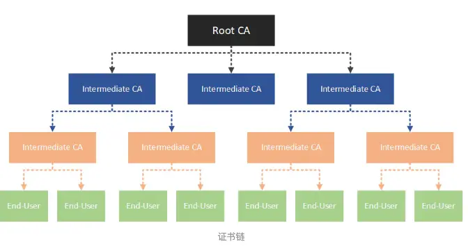
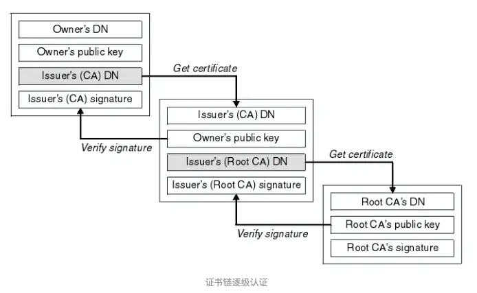
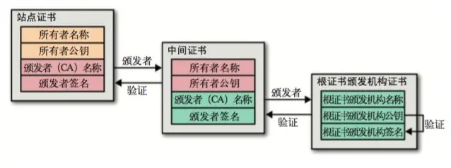

顾名思义，证书链是由一串数字证书链接而成，为了弄清楚这个概念，先看看什么是数字证书。

## 一、数字证书的基础知识

数字证书是用来认证公钥持有者身份合法性的电子文档，以防止第三方冒充行为。数字证书由 **CA（Certifacate Authority）** 负责签发，关键内容包括 **颁发s者**、**证书有效期**、**使用者组织**、**使用者公钥** 等信息。数字证书涉及到一个名为 **PKI（Public Key Infrastructure）** 的规范体系，包含了数字证书格式定义、密钥生命周期管理、数字签名及验证等多项技术说明，不在这篇笔记中详细展开。

我们借助下面的流程，看看 CA 是如何签发一张证书，使用者又是如何验证这样证书的。这又涉及到了数字签名技术，数字签名技术又是基于公钥密码技术。

现实世界中，签名是针对承诺的一种表现形式，手手段可以通过手写签字或盖扣印章；而在数字世界中，签名仍然是为了表示承诺，只是手段变成了二进制。

好，我们来看看 CA 数字签名包括两个过程：**签发证书（Signing）** 和 **验证证书（Verification）**

#### 签发证书的过程

1.  撰写证书元数据：包括 **签发人(Issuer)**、**地址**、**签发时间**、**有效期** 等，还包括证书持有者(Owner)基本信息，比如 **DN(DNS Name，即证书生效的域名)**、 **Owner 公钥** 等信息
2.  使用通用的 Hash 算法（如SHA-256）对证书元数据计算生成 **数字摘要**
3.  使用 Issuer 的私钥对该数字摘要进行加密，生成一个加密的数字摘要，也就是Issuer的 **数字签名**
4.  将数字签名附加到数字证书上，变成一个 **签过名的数字证书**
5.  将签过名的数字证书与 **Issuer 的公钥**，一同发给证书使用者（注意，将公钥主动发给使用者是一个形象的说法，只是为了表达使用者最终获取到了 Issuer 的公钥）

#### 验证证书的过程

1.  证书使用者获通过某种途径（如浏览器访问）获取到该数字证书，解压后分别获得 **证书元数据** 和 **数字签名**
2.  使用同样的Hash算法计算证书元数据的 **数字摘要**
3.  使用 **Issuer 的公钥** 对数字签名进行解密，得到 **解密后的数字摘要**
4.  对比 2 和 3 两个步骤得到的数字摘要值，如果相同，则说明这个数字证书确实是被 Issuer 验证过合法证书，证书中的信息（最主要的是 Owner 的公钥）是可信的

**上述是对数字证书的签名和验证过程，对普通数据的数字签名和验证也是利用了同样的方法。**

我们再来总结一下“签发证书”与“验证证书”两个过程，Issuer（CA）使用 **Issuer 的私钥** 对签发的证书进行数字签名，证书使用者使用 **Issuser 的公钥** 对证书进行校验，如果校验通过，说明该证书可信。

由此看出，校验的关键是 **Issuer 的公钥**，使用者获取不到 Issuer 的私钥，只能获取到 Issuer 的公钥，如果 Issuer 是一个坏家伙，谁来证明 **Issuer 的身份** 是可信的？

这就涉及到一个信任链条了，也是这篇笔记本身要讲述的事情，证书链。

## 二、证书链是什么

还是以百度为例，在浏览器上访问 “[www.baidu.com](http://www.baidu.com/)” 域名，地址连左侧有一个小锁的标志，点击就能查看百度的数字证书，如下图所示（使用的是谷歌浏览器）

百度数字证书

在图片的顶部，我们看到这样一个层次关系：

GlobalSign Root CA -> GlobalSign Organization Validation CA -> [baidu.com](http://baidu.com/)

这个层次可以抽象为三个级别：

1.  end-user：即 [baidu.com](http://baidu.com/)，该证书包含百度的公钥，访问者就是使用该公钥将数据加密后再传输给百度，即在 HTTPS 中使用的证书
2.  intermediates：即上文提到的 **签发人 Issuer**，用来认证公钥持有者身份的证书，负责确认 HTTPS 使用的 end-user 证书确实是来源于百度。这类 intermediates 证书可以有很多级，也就是说 **签发人 Issuer 可能会有有很多级**
3.  root：可以理解为 **最高级别的签发人 Issuer**，负责认证 intermediates 身份的合法性

这其实代表了一个信任链条，**最终的目的就是为了保证 end-user 证书是可信的，该证书的公钥也就是可信的。**

结合实际的使用场景对证书链进行一个归纳：

1.  为了获取 end-user 的公钥，需要获取 end-user 的证书，因为公钥就保存在该证书中
2.  为了证明获取到的 end-user 证书是可信的，就要看该证书是否被 intermediate 权威机构认证，等价于是否有权威机构的数字签名
3.  有了权威机构的数字签名，而权威机构就是可信的吗？需要继续往上验证，即查看是否存在上一级权威认证机构的数字签名
4.  信任链条的最终是Root CA，他采用自签名，对他的签名只能无条件的信任

说到无条件信任，也不用奇怪，尤瓦尔赫拉里在《人类简史》中已经阐述过，基于虚构故事所建立的信任，最终将人类待到了今天。

还有一个小问题，Root 根证书从何而来呢？除了自行下载安装之外，**浏览器、操作系统等都会内置一些 Root 根证书，称之为 Rrusted Root Certificates**。比如 Apple MacOS 官网就记录了操作系统中内置的可信任根证书列表。

[macOS High Sierra 中可用的受信任根证书列表](https://support.apple.com/zh-cn/HT208127)

* * *

证书链的基本原理就是这些，有一篇E文专门讲述证书链可供学习参考，链接如下：[What is the SSL Certificate Chain?](https://support.dnsimple.com/articles/what-is-ssl-certificate-chain/)

数字证书是一种普遍使用的身份认证方式，而另外一种认证方式，基于身份标识，也就是和PKI竞争的IBC（Identity-Based Cryptography）体系正在兴起。
