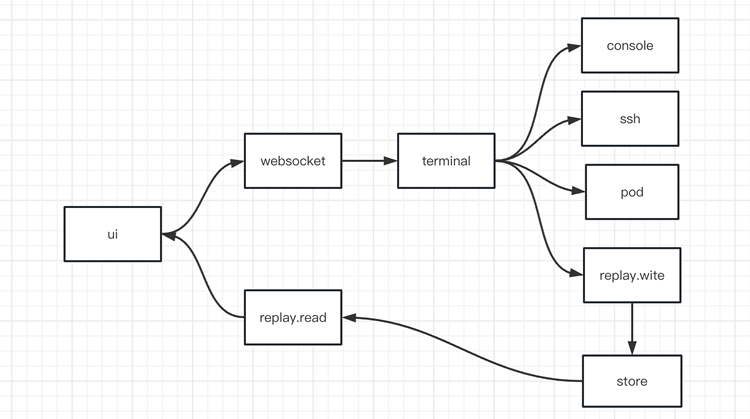
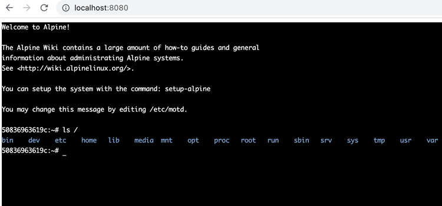

## 介绍

一个简单的 web 应用程序 demo，用作连接到 ssh 服务器的 ssh 客户端。它是用 go+xterm.js 编写的。

## 模块

模块交互图


### 前端 ui

使用 xterm.js 实现 demo 版本只用了简单的 html，达到效果就 OK

前端有个 FitAddon 插件，在 html 版本上用了，后面还是用 vue+xterm.js 实现前端吧。

### 后端

从交互图上可以看出，项目有两大功能，一个是 ssh 交互，一个是回放。在 ssh 通讯的过程中，交互的数据会被保存下来，这一步要录屏。

#### websocket

前端 ui 与 ssh 服务器通讯的桥梁，

#### terminal

封装各种 shell 的控制台。包含本地 shell、远程 ssh 和 k8s 中 pod 的 shell

#### replay

包含录屏与回放两种功能。

## SSH 服务器

输入下面命令建立一个 ssh 服务器，本 demo 提供了这个模拟 ssh 服务的默认参数，开箱即用。

```bash
docker run -d -p 222:22 --rm bimg/alpine-ssh
```

ssh 服务项目地址：
https://github.com/basicimage/alpine-ssh

## 效果



## 项目地址

https://github.com/go-webssh/demo
