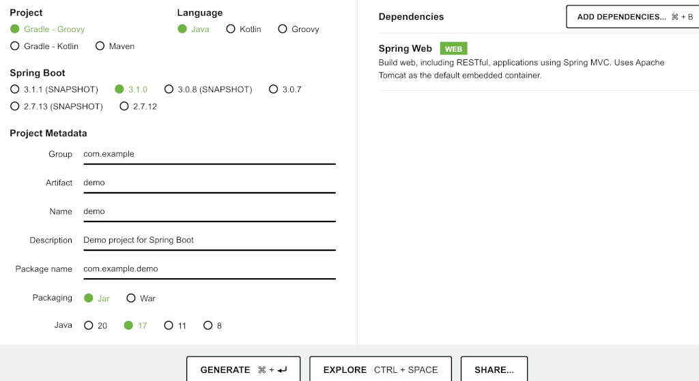

## 生成脚手架
https://start.spring.io/

参数如图：


## 功能列表
- web服务
- 注解使用
- 登录
- 鉴权
- 多模块
- 使用了spring的自动装配
- 拦截器使用
## 建立子app、common模块
使用idea->file->module
```bash
# app
name:app
language:java
build system:gradle
jdk:sdk17
parent:demo

# common
name:common
language:java
build system:gradle
jdk:sdk17
parent:demo
```
创建成功后，根目录src可以删除
## 创建demo文件
demo01/app/src/main/java/org/example/Main.java
```java
package org.example;

import org.springframework.boot.SpringApplication;
import org.springframework.boot.autoconfigure.SpringBootApplication;

@SpringBootApplication
public class Main {
    public static void main(String[] args) {
        SpringApplication.run(Main.class, args);
    }
}
```
demo01/app/src/main/java/org/example/rest/HelloController.java
```java
package org.example.rest;

import org.example.rest.annotation.LoginRequired;
import org.example.utils.Utils;
import org.springframework.web.bind.annotation.GetMapping;
import org.springframework.web.bind.annotation.RequestMapping;
import org.springframework.web.bind.annotation.RestController;

@RestController
@RequestMapping("/api")
public class HelloController {
    @GetMapping("/hello")
    public String helloWorld(){
        Integer i = Utils.add(1);
        Integer b = Utils.del(3);
        return "hello,world~" + i + "-" + b;
    }

    @GetMapping("/user")
    @LoginRequired
    public String user(){
        return "用户中心，需要登录";
    }
}
```
demo01/app/src/main/java/org/example/rest/annotation/LoginRequired.java
```java
package org.example.rest.annotation;


import java.lang.annotation.ElementType;
import java.lang.annotation.Retention;
import java.lang.annotation.RetentionPolicy;
import java.lang.annotation.Target;

/**
 * 在需要登录验证的Controller的方法上使用此注解
 */
@Target({ElementType.METHOD})// 可用在方法名上
@Retention(RetentionPolicy.RUNTIME)// 运行时有效
public @interface LoginRequired {
}
```
demo01/app/src/main/java/org/example/configs/WebConfig.java
```java
package org.example.configs;

import org.example.interceptor.AuthorityInterceptor;
import org.example.interceptor.LoginInterceptor;
import org.springframework.beans.factory.annotation.Autowired;
import org.springframework.context.annotation.Configuration;
import org.springframework.web.servlet.config.annotation.InterceptorRegistry;
import org.springframework.web.servlet.config.annotation.WebMvcConfigurer;

/**
 * 和springmvc的webmvc拦截配置一样
 * @author BIANP
 */
@Configuration
public class WebConfig implements WebMvcConfigurer {
    @Autowired
    private LoginInterceptor loginInterceptor;
    @Autowired
    private AuthorityInterceptor authorityInterceptor;
    @Override
    public void addInterceptors(InterceptorRegistry registry) {
        // 拦截所有请求，通过判断是否有 @LoginRequired 注解 决定是否需要登录
        registry.addInterceptor(loginInterceptor).addPathPatterns("/**");
        registry.addInterceptor(authorityInterceptor).addPathPatterns("/**");
    }

}
```
demo01/app/src/main/java/org/example/interceptor/AuthorityInterceptor.java
```java
package org.example.interceptor;

import jakarta.servlet.http.HttpServletRequest;
import jakarta.servlet.http.HttpServletResponse;
import org.example.rest.annotation.LoginRequired;
import org.springframework.stereotype.Service;
import org.springframework.web.method.HandlerMethod;
import org.springframework.web.servlet.HandlerInterceptor;

import java.lang.reflect.Method;

@Service
public class AuthorityInterceptor implements HandlerInterceptor {
    @Override
    public boolean preHandle(HttpServletRequest request, HttpServletResponse response, Object handler) throws Exception {
        // 如果不是映射到方法直接通过
        if (!(handler instanceof HandlerMethod)) {
            return true;
        }
        // ①:START 方法注解级拦截器
        HandlerMethod handlerMethod = (HandlerMethod) handler;
        Method method = handlerMethod.getMethod();
        // 判断接口是否需要登录
        LoginRequired methodAnnotation = method.getAnnotation(LoginRequired.class);
        // 有 @LoginRequired 注解，需要认证
        if (methodAnnotation != null) {
            // 这写你拦截需要干的事儿，比如取缓存，SESSION，权限判断等
            System.out.println("AuthorityInterceptor====================================");
            return true;
        }
        return true;
    }
}
```
demo01/app/src/main/java/org/example/interceptor/Const.java
```java
package org.example.interceptor;

/**
 * @author     BianP
 * @explain 常量类
 */
public class Const {
    // 不验证URL anon：不验证/authc：受控制的
    public static final String NO_INTERCEPTOR_PATH =".*/((.css)|(.js)|(images)|(login)|(anon)).*";
}
```
demo01/app/src/main/java/org/example/interceptor/LoginInterceptor.java
```java
package org.example.interceptor;


import jakarta.servlet.http.HttpServletRequest;
import jakarta.servlet.http.HttpServletResponse;
import org.springframework.stereotype.Service;
import org.springframework.web.servlet.HandlerInterceptor;

@Service
public class LoginInterceptor implements HandlerInterceptor {
    /**
     * 在请求处理之前进行调用（Controller方法调用之前）
     * 基于URL实现的拦截器
     * @param request
     * @param response
     * @param handler
     * @return
     * @throws Exception
     */
    @Override
    public boolean preHandle(HttpServletRequest request, HttpServletResponse response, Object handler) throws Exception {
        String path = request.getServletPath();
        if (path.matches(Const.NO_INTERCEPTOR_PATH)) {
            //不需要的拦截直接过
        } else {
            // 这写你拦截需要干的事儿，比如取缓存，SESSION，权限判断等
            System.out.println("LoginInterceptor====================================");
        }
        return true;
    }
}
```
demo01/common/src/main/java/org/example/utils/Utils.java
```bash
package org.example.utils;

public class Utils {
    public static Integer add(Integer a) {
        return a + a;
    }

    public static Integer del(Integer a) {
        return a  - 1;
    }
}
```
## 项目地址
https://github.com/java-sig/demo