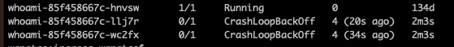
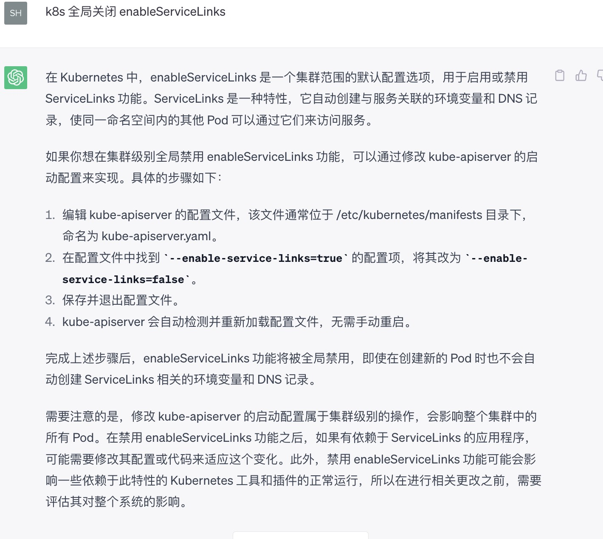

## 起因
今天为一个测试服务增加实例，发现启动不起来了，但原来的有的实例正常运行，把正常的pod删除后，所有pod都异常了。具体如图：



## 排查
### 查看pod日志：
```bash
kubectl logs -f whoami-85f458667c-f5nw9
2023/06/02 02:24:31 listen tcp: address :tcp://10.101.156.195:8080: too many colons in address
```

发现是端口不对导致
### 查看部署文件：
```bash
kubectl get deploy whoami -oyaml
```
发现并没有对env进行设置，查看whoami源码，发现`port`是受环境变量`WHOAMI_PORT`控制

https://github.com/freemesh/whoami/blob/main/main.go

### 查看问题pod的环境变量
进入问题pod所在机器，查看容器的详细信息，发现ENV下有很多环境变量，其中就包括`WHOAMI_PORT`：
```bash
docker inspect 0c842287ada4

"Env": [
    "NGINX_SERVICE_PORT=8080",
    "NGINX_PORT_8080_TCP_PROTO=tcp",
    "NGINX_PORT_8080_TCP_PORT=8080",
    "MY_INGRESS_SERVICE_HOST=10.101.163.141",
    "KUBERNETES_SERVICE_PORT=443",
    "NGINX_PORT_8080_TCP_ADDR=10.105.237.147",
    "MY_INGRESS_PORT_8080_TCP_PROTO=tcp",
    "ENVTEST_SERVICE_PORT=8080",
    "ENVTEST_PORT_8080_TCP_PORT=8080",
    "KUBERNETES_PORT_443_TCP=tcp://10.96.0.1:443",
    "KUBERNETES_PORT_443_TCP_PORT=443",
    "WHOAMI_SERVICE_PORT=8080",
    "WHOAMI_PORT_8080_TCP_ADDR=10.101.156.195",
    "WHOAMI_PORT_8080_TCP=tcp://10.101.156.195:8080",
    "WHOAMI_PORT_8080_TCP_PROTO=tcp",
    "NGINX_SERVICE_HOST=10.105.237.147",
    "MY_INGRESS_PORT=tcp://10.101.163.141:8080",
    "MY_INGRESS_PORT_8080_TCP_ADDR=10.101.163.141",
    "ENVTEST_PORT_8080_TCP_PROTO=tcp",
    "KUBERNETES_SERVICE_PORT_HTTPS=443",
    "WHOAMI_PORT=tcp://10.101.156.195:8080",  #这个就是程序里用到的环境变量
    "MY_INGRESS_SERVICE_PORT=8080",
    "MY_INGRESS_PORT_8080_TCP=tcp://10.101.163.141:8080",
    "MY_INGRESS_PORT_8080_TCP_PORT=8080",
    "ENVTEST_PORT=tcp://10.101.53.28:8080",
    "KUBERNETES_SERVICE_HOST=10.96.0.1",
    "KUBERNETES_PORT_443_TCP_ADDR=10.96.0.1",
    "NGINX_PORT=tcp://10.105.237.147:8080",
    "ENVTEST_SERVICE_HOST=10.101.53.28",
    "ENVTEST_PORT_8080_TCP=tcp://10.101.53.28:8080",
    "WHOAMI_SERVICE_HOST=10.101.156.195",
    "WHOAMI_PORT_8080_TCP_PORT=8080",
    "NGINX_PORT_8080_TCP=tcp://10.105.237.147:8080",
    "ENVTEST_PORT_8080_TCP_ADDR=10.101.53.28",
    "KUBERNETES_PORT=tcp://10.96.0.1:443",
    "KUBERNETES_PORT_443_TCP_PROTO=tcp",
    "PATH=/usr/local/sbin:/usr/local/bin:/usr/sbin:/usr/bin:/sbin:/bin"
],
```
## 原因
原来，我们创建servicer的时候，k8s会自动为pod增加svc的环境变量,我们可以在pod.spec增加 `enableServiceLinks:false` 来关闭这项特性。

参考
https://kubernetes.io/docs/tutorials/services/connect-applications-service/#accessing-the-service

pod配置详解见： [k8s的pod.yaml文件配置详解]()
## 解决
```bash
kubectl edit deploy whoami
```
在`spec.template.spec`下增加`enableServiceLinks:false`发现pod可以正常运行了。

## PS

### 什么样的服务有会向pod添加env
对于无头服务`clusterIP: None`的service不会添加env

### 全局关闭
询问chatGPT，是否可以全局关闭：

修改apiservers配置
```bash
vi /etc/kubernetes/manifests/kube-apiserver.yaml
```
按这个方法，apiserver启动报错：
```bash
docker logs -f c5b494249fe3
Error: unknown flag: --enable-service-links
```

查看kube-apiserver也没这个参数，gpt也会忽悠，估计是不能全局关闭了。

https://kubernetes.io/zh-cn/docs/reference/command-line-tools-reference/kube-apiserver/