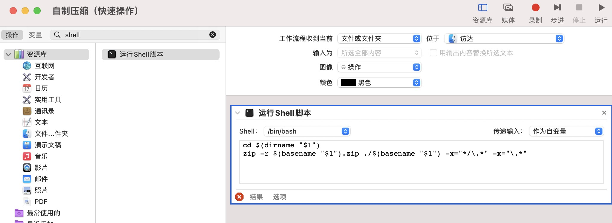

mac利用自带的压缩软件压缩文件时，老是会把_MACOS,._开头的文件压缩到zip压缩包中，在rar中看时多了很多打不开的文件，在win系统中使用压缩包时带来很多烦恼。今天研究了一天，找到方法自动排除这些文件了。利用自动操作在右键菜单中做一个压缩命令即可。

具体步骤为：

打开`自动操作`，选择快速操作的编辑界面，如下图设置好，保存即可。


图中的shell代码为：
```bash
cd $(dirname "$1")
zip -r $(basename "$1").zip ./$(basename "$1") -x="*/\.*" -x="\.*"
```

设置并保存好了，就可以去文件夹中，找一个文件夹或者文件测试，选定文件夹或文件，右键->服->自制压缩，在当前文件夹下就会出现一个同名的zip文件。这个zip文件比系统自带的压缩更干净，已经自动排除了隐藏文件和系统文件了。