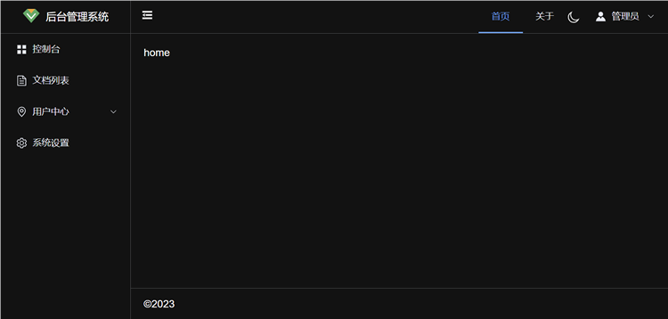

## 介绍
vue-admin是一个后台管理脚手架，由vue3 + vite + typescript + element-plus + pinia + vue-router + axios技术栈开发。

项目地址：[https://github.com/vue-admin/vue-admin](https://github.com/vue-admin/vue-admin)

文档地址：[https://doc.cncf.vip/vue-admin](https://doc.cncf.vip/vue-admin)

DEMO: [https://demo.cncf.vip/vue-admin/](https://demo.cncf.vip/vue-admin/)

## 界面
### 正常模式

### 暗黑模式

## 为什么需要该项目
本人主要从事云原生中间件相关的工作，需要产品化才能让更多的用户使用，前端技术也是产品化的重要项，多项技术结合形成生态，从而产生更大的价值。
### 为什么要造轮子？
网上vue相关的后台管理系统那么多，为什么还要做一个？程序员圈子里流行这么一句话：“不要重复造轮子”。

首先我们要搞清楚两个概念 —— 造轮子和发明轮子。轮子是在距今6800年前被发明出来，在此之前我们的祖先可能已经就在尝试对轮子的创造。从三角形、四边形、五边形等等，一直到最后的圆形轮子，每种轮子都不一样，这叫做发明轮子。

而当轮子的形状确定后，再发明其它形状的轮子就没有意义了，改进轮子才是重点，于是就有了石轮、木轮、空心木轮、气轮的转变。而现在，气轮也有多种款式，适用于不同的场景，这叫做造轮子。

可以看出，发明轮子已经变得毫无意义，但是造轮子依然是人们所关注的焦点。

所以：

1.本项目不是重复造轮子，是创造产品需要的好轮子。

2.通过发明新轮子从而学习到更多的前端知识。

3.本项目是后台前端系统的底坐。
